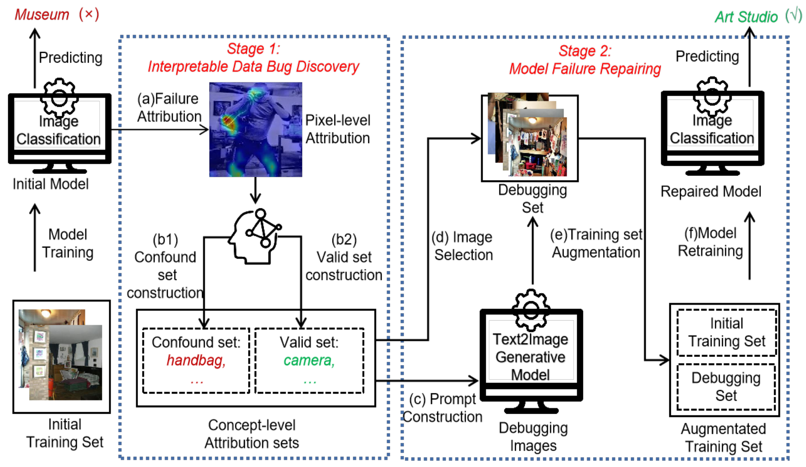

# AACA: Attribution Analysis-based Concept Alignment: A Human-centered Data Debugging Framework

This repository contains PyTorch implementation of our paper [AACA: Attribution Analysis-based Concept Alignment: A Human-centered Data Debugging Framework.]()



* This repo is a modification on the [MAE repo](https://github.com/facebookresearch/mae). Installation and preparation follow that repo.


## Fine-tune
```
OMP_NUM_THREADS=1 python -m torch.distributed.launch --nproc_per_node=4 --use_env main_finetune.py    
 --accum_iter 4     
 --batch_size 64
 --model vit_base_patch16     
 --epochs 100     
 --blr 5e-4 
 --layer_decay 0.65     
 --weight_decay 0.05 
 --drop_path 0.1 
 --mixup 0.8 
 --cutmix 1.0 
 --reprob 0.25  
 --data_path ./places365/generated_based_12_prompt_with_concept_debugset/    
 --output_dir ./12_sub_classes_prompt_with_concept_based_output_dir    
 --log_dir ./12_sub_classes_prompt_with_concept_based_output_dir   
 --dist_eval
```

The following table provides the fine-tuned checkpoints used in the paper:
<table><tbody>
<!-- START TABLE -->
<!-- TABLE HEADER -->
<th valign="bottom">Debug-Train method\checkpoints</th>
<th valign="bottom">Checkpoints</th>

<!-- TABLE BODY -->
<tr><td align="left">S-Random</td>
<td align="center"><a href="">download</a></td>
</tr>
<tr><td align="left">S-Similarity</td>
<td align="center"><a href="">download</a></td>

</tr>
<tr><td align="left">S-Active Learning</td>
<td align="center"><a href="">download</a></td>

</tr>
<tr><td align="left">G-LLM</td>
<td align="center"><a href="">download</a></td>
</tr>
<tr><td align="left">G-TG</td>
<td align="center"><a href="">download</a></td>
</tr>
<tr><td align="left">G-LLM-prompt</td>
<td align="center"><a href="">download</a></td>
</tr>
<tr><td align="left">Ours</td>
<td align="center"><a href="">download</a></td>
</tr>

</tbody></table>
Note: We have uploaded the model to Google Drive, but in order to comply with anonymity guidelines, we have chosen to wait until the article is published before sharing our Google Drive link.
### Methods Overview

#### S-Random (Random Selection Method)
For each class, we randomly select 1000 images to be used as the final debug instances. This method is simple and effective for obtaining a diverse set of instances from each class without any additional criteria.

#### S-Similarity (Similarity-Based Selection Method)
Inspired by [Singla et al., 2022](https://arxiv.org/abs/2204.08074), this method uses the penultimate layer output of a pre-trained Vision Transformer (ViT) model as the image embedding. For each class, misclassified images are fed into the ViT model to obtain their embeddings, and then the average embedding of these misclassified images is calculated. The squared l2 distance between each image and the average embedding is computed, and the 1000 images with the closest distances are selected as debug instances.

#### S-Active Learning (Active Learning-Based Selection Method)
This method employs an active learning strategy using maximum entropy [Gal et al., 2017](https://arxiv.org/abs/1703.02910). The images in each class are fed into a pre-trained ViT model to compute their entropy values. The 1000 images with the highest entropy values (i.e., the most uncertain predictions) are selected as the final debug instances for each class. This method aims to select samples that are most likely to improve the model when labeled and added to the training set.

#### G-LLM (Text-to-Image Generative Model)
The G-LLM method uses a text-to-image generative model, such as Stable Diffusion [Rombach et al., 2022](https://arxiv.org/abs/2112.10752), to generate synthetic images. This method is useful for creating images that are conceptually similar to the target dataset, which can aid in augmenting the training data and debugging model failures.

#### G-TG (Tailor Generation Method)
The G-TG method combines Stable Diffusion with Textual Inversion [Gal et al., 2022](https://arxiv.org/abs/2205.06238). It encodes each class in the dataset as a unique token in the model's text space. By integrating these tokens into natural language prompts, G-TG generates counterfactual examples that are visually similar to the original data but can expose model weaknesses in certain areas. This technique helps in generating examples that adhere closely to the distribution of the target data.

#### G-LLM-prompt (GPT-4 + Stable Diffusion)
In the G-LLM-prompt approach, we initially use GPT-4 to generate a list of 10 representative concepts for each of the 12 indoor scenes. These concepts are then integrated into prompts like "a `<class>` with a `<concept>`" to invoke the Stable Diffusion model to generate images. This method leverages large language models (LLM) to generate more diverse and contextually accurate synthetic images.

#### G-TG-human-prompt (Ours)
This is our proposed method, which builds upon G-TG by incorporating **concept-level attribution analysis**. We first analyze the data to identify potential model failures and data bugs, then use the analysis results to guide the generation of synthetic debug images using Stable Diffusion. This process helps repair model failures by augmenting the training set with specifically designed images that improve model performance.


## Datasets

We have uploaded the dataset to Google Drive, but in order to comply with anonymity guidelines, we have chosen to wait until the article is published before sharing our Google Drive link.


